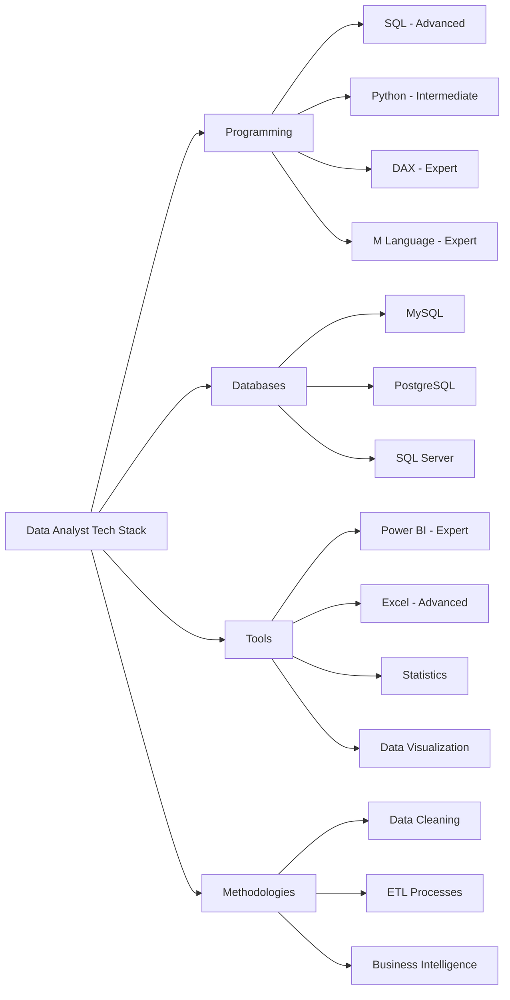

# Hi, I'm Deep! 👋

### 📊 Power BI Developer | Data Analyst | Business Intelligence Specialist

<!-- Banner -->

  

Welcome to my GitHub profile! I'm a passionate **Power BI Developer** and **Data Analyst** with expertise in end-to-end data solutions - from data extraction to interactive dashboard creation and business insights delivery.

---

## 🚀 Featured Projects

<!-- Projects Grid -->

### 📊 Power BI Dashboard Portfolio

| Category | Project | Tech Stack | Key Features |
|----------|---------|------------|--------------|
| **📈 Business Analytics** | 🛒 **[Blinkit Dashboard](https://github.com/mydeepcode/Blinkit-Inventory-Performance-Analysis)** | `Power BI` `DAX` `Power Query` `Excel` | Sales Trends, Inventory Analytics, Performance KPIs |
| **🏢 Sales & Retail** | 👟 **[Adidas Sales](https://github.com/mydeepcode/Adidas-Business-Analysis-Dashboard)** | `Power BI` `DAX` `Data Modeling` `SQL` | Revenue Analysis, Regional Performance, Product Metrics |
| **👥 HR Analytics** | 👥 **[HR Analytics](https://github.com/mydeepcode/HR-Dashboard)** | `Power BI` `Power Query` `DAX` `Excel` | Workforce Analytics, Attrition Analysis, Performance Tracking |
| **💳 Finance** | 💳 **[Credit Card Analysis](https://github.com/mydeepcode/Credit-Card-Transaction-Analysis-Dashboard)** | `Power BI` `DAX` `SQL` `Data Viz` | Spending Patterns, Customer Segmentation, Transaction Insights |
| **📊 Project Management** | 📊 **[Project Management](https://github.com/mydeepcode/Project-Management-Dashboard)** | `Power BI` `Power Query` `DAX` | Resource Management, Timeline Tracking, Milestone Monitoring |
| **🏥 Healthcare** | ❤️ **[Heart Disease](https://github.com/mydeepcode/Heart-Disease-Analysis-Dashboard)** | `Power BI` `Statistics` `Data Viz` | Medical Analytics, Risk Assessment, Health Insights |
| **✈️ Aviation** | ✈️ **[Flight Weather](https://github.com/mydeepcode/Weather-Impact-on-Flight-Operations-Dashboard-Power-BI-Project-)** | `Power BI` `DAX` `Data Modeling` | Operational Analytics, Weather Impact, Delay Analysis |
| **🛍️ Retail** | 🛍️ **[Retail Analysis](https://github.com/mydeepcode/Retail-Analysis-Dashboard)** | `Power BI` `DAX` `SQL` `Excel` | Customer Analytics, Sales Performance, Inventory Management |

---

## 🛠️ Technical Skills

### **📊 Power BI Developer Skills**

| Core Power BI Skills | Proficiency | Key Capabilities |
|---------------------|-------------|------------------|
| **Power BI Desktop** | ⭐⭐⭐⭐⭐ | Report Development, Data Visualization, UI/UX Design |
| **DAX (Data Analysis Expressions)** | ⭐⭐⭐⭐⭐ | Complex Calculations, Time Intelligence, Measures |
| **Power Query & M Language** | ⭐⭐⭐⭐⭐ | ETL, Data Transformation, Data Cleaning |
| **Data Modeling** | ⭐⭐⭐⭐⭐ | Star Schema, Relationships, Performance Optimization |
| **Power BI Service** | ⭐⭐⭐⭐ | Report Publishing, Dashboards, Workspace Management |
| **Power BI Mobile** | ⭐⭐⭐⭐ | Mobile Report Optimization, Responsive Design |

### **🔧 Data Analyst Technical Skills**

#### **Programming & Query Languages**

#### **Technical Proficiency Breakdown**

##### **📊 Data Visualization & BI Tools**

  

##### **💻 Programming & Databases**

  

##### **📈 Data Analysis & Statistics**

  

##### **🛠️ Data Processing & ETL**

  

### **🎯 Core Competencies Matrix**

| Skill Category | Specific Skills | Proficiency Level |
|----------------|-----------------|-------------------|
| **Power BI Development** | Dashboard Design, DAX, Power Query, Data Modeling, Report Publishing | Expert |
| **Data Analysis** | Statistical Analysis, Trend Analysis, KPI Development, Business Insights | Advanced |
| **SQL & Databases** | Complex Queries, Joins, CTEs, Subqueries, Performance Tuning | Advanced |
| **Data Visualization** | Chart Selection, Color Theory, UX Design, Storytelling | Expert |
| **Business Intelligence** | Requirements Gathering, KPI Definition, Stakeholder Management | Advanced |
| **Data Preparation** | Data Cleaning, ETL Processes, Data Validation, Quality Assurance | Expert |

---

## 📊 GitHub Stats & Activity

<!-- Dynamic GitHub Stats -->

<table>
  <tr>
    <td align="center">
      
    </td>
    <td align="center">
      
    </td>
  </tr>
  <tr>
    <td colspan="2" align="center">
      
    </td>
  </tr>
</table>

---

## 💼 Professional Services

### **🎯 Power BI Development Services**
<table>
  <tr>
    <td width="33%">
      <h4>📊 Custom Dashboard Development</h4>
      <ul>
        <li>End-to-end Power BI solutions</li>
        <li>Interactive report design</li>
        <li>Business requirement analysis</li>
      </ul>
    </td>
    <td width="33%">
      <h4>⚡ Advanced DAX Implementation</h4>
      <ul>
        <li>Complex calculations</li>
        <li>Time intelligence functions</li>
        <li>Business logic implementation</li>
      </ul>
    </td>
    <td width="33%">
      <h4>🗃️ Data Modeling & Architecture</h4>
      <ul>
        <li>Star schema design</li>
        <li>Relationship management</li>
        <li>Performance optimization</li>
      </ul>
    </td>
  </tr>
</table>

### **🔍 Data Analysis Services**
<table>
  <tr>
    <td width="50%">
      <h4>📈 Business Intelligence</h4>
      <ul>
        <li>KPI development & tracking</li>
        <li>Performance monitoring</li>
        <li>Strategic insights delivery</li>
      </ul>
    </td>
    <td width="50%">
      <h4>📊 Statistical Analysis & Reporting</h4>
      <ul>
        <li>Trend analysis & forecasting</li>
        <li>Data-driven recommendations</li>
        <li>Automated reporting solutions</li>
      </ul>
    </td>
  </tr>
</table>

### **🛠️ Technical Implementation**
<table>
  <tr>
    <td width="50%">
      <h4>🔧 ETL & Data Engineering</h4>
      <ul>
        <li>Data extraction & transformation</li>
        <li>Power Query automation</li>
        <li>Data quality assurance</li>
      </ul>
    </td>
    <td width="50%">
      <h4>☁️ Cloud & Mobile Solutions</h4>
      <ul>
        <li>Power BI Service deployment</li>
        <li>Mobile-responsive design</li>
        <li>Data gateway setup</li>
      </ul>
    </td>
  </tr>
</table>

---

## 🎯 Currently Working On

### 🚀 Active Development Focus

**Advanced Power BI Projects**: Implementing complex DAX patterns and AI integration  
**Learning Path**: Python for advanced analytics and machine learning integration with Power BI  
**Collaboration**: Enterprise-level BI solutions and dashboard optimization  
**Availability**: Power BI development, data analysis projects, and BI consultations  

**Tech Stack Focus:** `Power BI` `DAX` `Power Query` `SQL` `Python` `Excel` `Data Modeling`

---

## 🔥 Recent Technical Updates

### 🎯 Technical Milestones Achieved

<table>
  <tr>
    <td align="center">
      <h4>✅ DAX Optimization</h4>
      
Advanced time intelligence functions implemented across multiple projects

    </td>
    <td align="center">
      <h4>✅ SQL Performance</h4>
      
Query optimization for enhanced data retrieval speed and efficiency

    </td>
  </tr>
  <tr>
    <td align="center">
      <h4>✅ Data Architecture</h4>
      
Star schema implementation with optimized relationship management

    </td>
    <td align="center">
      <h4>✅ Advanced Analytics</h4>
      
Python integration for predictive modeling and statistical analysis

    </td>
  </tr>
</table>

---

## 🏆 GitHub Achievements

<table>
  <tr>
    <td align="center">
      <h3>🏆 High Repo Creator</h3>
      
27+ Projects

    </td>
    <td align="center">
      <h3>⭐ Repository Stars</h3>
      
Growing Community

    </td>
    <td align="center">
      <h3>💻 Intermediate Developer</h3>
      
14+ Points

    </td>
  </tr>
  <tr>
    <td align="center">
      <h3>📝 Middle Committer</h3>
      
68+ Commits

    </td>
    <td align="center">
      <h3>👥 First Friend</h3>
      
1+ Follower

    </td>
    <td align="center">
      <h3>🔧 Active Maintainer</h3>
      
Continuous Updates

    </td>
  </tr>
</table>

### 🎖️ Technical Proficiencies
- **Power BI Development & Data Modeling** - Expert Level
- **Advanced SQL & Database Management** - Advanced Level  
- **Data Analysis & Business Intelligence** - Professional Level
- **ETL Processes & Data Transformation** - Expert Level

---

## 📫 Let's Connect!

<table>
  <tr>
    <td align="center">
      
    </td>
    <td align="center">
      
    </td>
  </tr>
  <tr>
    <td align="center">
      
    </td>
    <td align="center">
      
    </td>
  </tr>
</table>

---

## 📋 Technical Repository Features

<table>
  <tr>
    <td align="center">
      <h4>📊 Power BI Development</h4>
      
Complete .pbix files with advanced DAX

      <small>✅ Code Comments & Explanations</small>
    </td>
    <td align="center">
      <h4>🗃️ SQL Optimization</h4>
      
Optimized database queries

      <small>✅ Query Explanations</small>
    </td>
  </tr>
  <tr>
    <td align="center">
      <h4>📈 Data Models</h4>
      
Star schema relationships

      <small>✅ Data Model Diagrams</small>
    </td>
    <td align="center">
      <h4>🔄 ETL Processes</h4>
      
Power Query M scripts

      <small>✅ Transformation Documentation</small>
    </td>
  </tr>
</table>

---

## 🚀 Quick Links

---

### 🌟 *Power BI Developer | Data Analyst | BI Specialist* 🌟

*"Transforming complex datasets into interactive, actionable insights using cutting-edge data technologies."*

**⭐ Star my repositories if you find the technical implementations useful!**

---

**Last Updated:** November 2024

**🚀 Looking for a Power BI Developer? Let's connect and build amazing data solutions together!**
